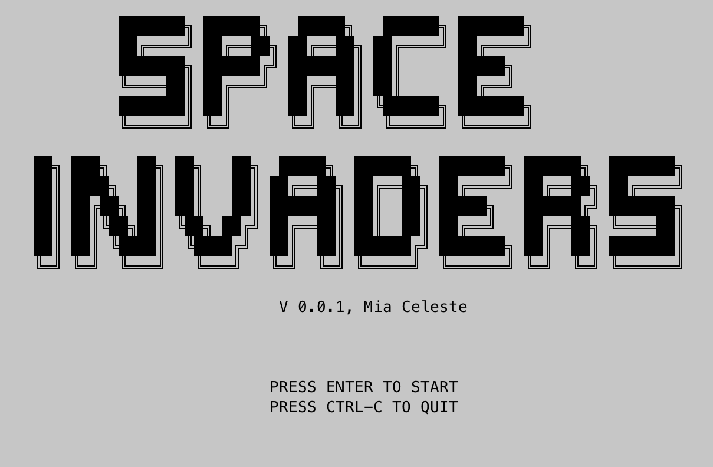
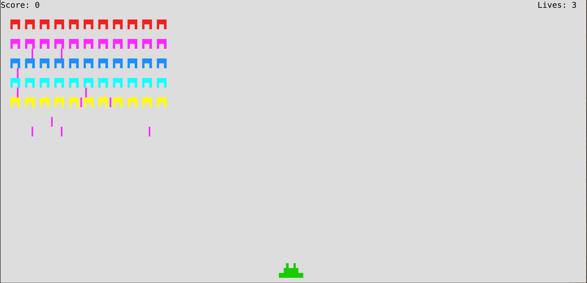

# Space Invaders

A simple implementation of the arcade game Space Invaders in Rust with crossterm.




## Run the game

```sh
git clone https://github.com/mia1024/space-invaders
cd space-invaders
cargo run
```

## Control

Press left and right arrow keys to move, space bar to fire.

## Configuration

You can change the game configurations by editing the `config.ini` file. If you omit a field, the default value, defined in `config_default.int` will be used.

## Terminal requirement

Your terminal needs to be xterm-256 color compatible to run the game. 
